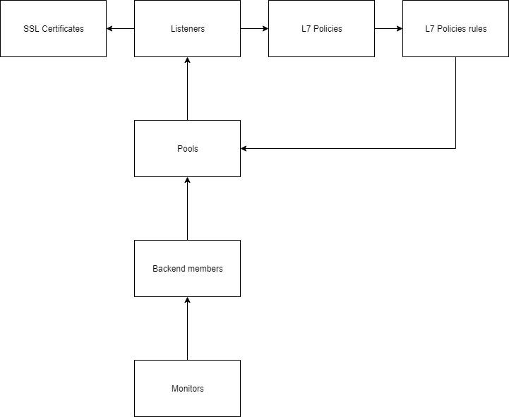

# Flexible Engine Enhanced Elastic Load Balancer Terraform Module

Terraform module for deploying an Elastic Load Balancer

## TF version : 0.12

## Module scope 

This Terraform module Elastic Load Balancer for Flexible Engine cover :

- Listeners configuration TCP/HTTP/HTTPS (With SSL certificate, and whitelist)
- Backends/Pools configuration with members
- Monitoring of backend members
- L7 Policies to redirect HTTP requests to another listener or pool.

## Resources module architecture



## Terraform format
```hcl
module "elb_web" {
  source = "terraform-flexibleengine-modules/elb/flexibleengine"
  version = "1.0.0"

  loadbalancer_name = "my-http-elb"

  subnet_id = "my-subnet-id"

  bind_eip = true

  cert = true

  domain = "my-domain-name.com"

  cert_name = "my-cert-name"

  certId = "my-cert-id"

  vip_address = "192.168.13.148"

  listeners = [
              {
              name = "http"
              port = 80
              protocol = "HTTP"
              hasCert = false
              },
              {
              name = "https"
              port = 443
              protocol = "TERMINATED_HTTPS"
              hasCert = true
              }
              ]

  pools = [   {
              name = "poolhttp"
              protocol = "HTTP"
              lb_method = "ROUND_ROBIN"
              listener_index = 0
              },
              {
              name = "poolhttps"
              protocol = "HTTP"
              lb_method = "ROUND_ROBIN"
              listener_index = 1
              }
            ]

  backends = [
            {
              name = "backend1"
              port = 80
              address_index = 0
              pool_index = 0
              subnet_id = "backend1-subnet-id"
            },
            {
              name = "backend2"
              port = 80
              address_index = 1
              pool_index = 0
              subnet_id = "backend2-subnet-id"
            },
            {
              name = "backend3"
              port = 443
              address_index = 0
              pool_index = 1
              subnet_id = "backend3-subnet-id"
            },
            {
              name = "backend4"
              port = 443
              address_index = 1
              pool_index = 1
              subnet_id = "backend4-subnet-id"
            }
            ]

    backends_addresses = ["192.168.13.102","192.168.13.247"]

    monitorsHttp =  [
            {
              name = "monitor1"
              pool_index = 0
              protocol = "HTTP"
              delay = 20
              timeout = 10
              max_retries = 3
              url_path = "/check"
              http_method = "GET"
              expected_codes = "2xx,3xx,4xx"
            },
            {
              name = "monitor2"
              pool_index = 1
              protocol = "HTTP"
              delay = 20
              timeout = 10
              max_retries = 3
              url_path = "/check"
              http_method = "GET"
              expected_codes = "2xx,3xx,4xx"
            }
            ]    

    listeners_whitelist = [
      {
        enable_whitelist = true
        whitelist = "192.168.11.1,192.168.0.1/24,192.168.201.18/8"
        listeners_index = 0
      }
    ]


}
```

## Terragrunt format
```hcl
################################
### Terragrunt Configuration ###
################################

terraform {
  source = "terraform-flexibleengine-modules/elb/flexibleengine"
  version = "1.0.0"
}

include {
  path = find_in_parent_folders()
}

##################
### Parameters ###
##################

inputs = {

  loadbalancer_name = "my-http-elb"

  subnet_id = "my-subnet-id"

  bind_eip = true

  cert = true

  domain = "my-domain-name.com"

  cert_name = "my-cert-name"

  certId = "my-cert-id"

  vip_address = "192.168.13.148"

  listeners = [
              {
              name = "http"
              port = 80
              protocol = "HTTP"
              hasCert = false
              },
              {
              name = "https"
              port = 443
              protocol = "TERMINATED_HTTPS"
              hasCert = true
              }
              ]

  pools = [   {
              name = "poolhttp"
              protocol = "HTTP"
              lb_method = "ROUND_ROBIN"
              listener_index = 0
              },
              {
              name = "poolhttps"
              protocol = "HTTP"
              lb_method = "ROUND_ROBIN"
              listener_index = 1
              }
            ]

  backends = [
            {
              name = "backend1"
              port = 80
              address_index = 0
              pool_index = 0
              subnet_id = "backend1-subnet-id"
            },
            {
              name = "backend2"
              port = 80
              address_index = 1
              pool_index = 0
              subnet_id = "backend2-subnet-id"
            },
            {
              name = "backend3"
              port = 443
              address_index = 0
              pool_index = 1
              subnet_id = "backend3-subnet-id"
            },
            {
              name = "backend4"
              port = 443
              address_index = 1
              pool_index = 1
              subnet_id = "backend4-subnet-id"
            }
            ]

    backends_addresses = ["192.168.13.102","192.168.13.247"]

    monitorsHttp =  [
            {
              name = "monitor1"
              pool_index = 0
              protocol = "HTTP"
              delay = 20
              timeout = 10
              max_retries = 3
              url_path = "/check"
              http_method = "GET"
              expected_codes = "2xx,3xx,4xx"
            },
            {
              name = "monitor2"
              pool_index = 1
              protocol = "HTTP"
              delay = 20
              timeout = 10
              max_retries = 3
              url_path = "/check"
              http_method = "GET"
              expected_codes = "2xx,3xx,4xx"
            }
            ]    

    listeners_whitelist = [
      {
        enable_whitelist = true
        whitelist = "192.168.11.1,192.168.0.1/24,192.168.201.18/8"
        listeners_index = 0
      }
    ]
}

```

## Inputs


| Name | Description | Type | Default | Required |
|------|-------------|------|---------|:-----:|
| backends | List of backends | <pre>list(object({<br>    name          = string<br>    port          = number<br>    address_index = string<br>    pool_index    = number<br>    subnet_id     = string<br>  }))<br></pre> | n/a | yes |
| backends\_addresses | List of backends adresses | `list` | n/a | yes |
| bind\_eip | Boolean to know if we bind an EIP | `bool` | `true` | no |
| cert | Boolean to know if we add certificate | `bool` | `false` | no |
| certId | n/a | `string` | `""` | no |
| cert\_name | n/a | `string` | `""` | no |
| certificate | n/a | `string` | `""` | no |
| domain | n/a | `string` | `""` | no |
| eip\_addr | Address of an existing EIP to attach (ex: 1.2.3.4). Left null will create a new EIP | `string` | n/a | yes |
| l7policies | List of L7 policies redirected to pools/listeners | <pre>list(object({<br>    name                      = string<br>    action                    = string # REDIRECT_TO_POOL / REDIRECT_TO_LISTENER<br>    description               = string<br>    position                  = number<br>    listener_index            = number<br>    redirect_listener_index   = number # if REDIRECT_TO_LISTENER is set, or null LISTENER must be listen on HTTPS_TERMINATED<br>    redirect_pool_index       = number # if REDIRECT_TO_POOL is set, or null - pool used to redirect must be not associated with a listener<br>  }))<br></pre> | `[]` | no |
| l7policies\_rules | List of L7 policies redirected to pools/listeners | <pre>list(object({<br>    l7policy_index  = number<br>    type            = string<br>    compare_type    = string<br>    value           = string<br>  }))<br></pre> | `[]` | no |
| listeners | Listeners list | <pre>list(object({<br>    name     = string<br>    port     = number<br>    protocol = string #Protocol used TCP, UDP, HTTP or TERMINATED_HTTPS<br>    hasCert  = bool<br>  }))<br></pre> | n/a | yes |
| listeners\_whitelist | Listeners whitelist | <pre>list(object({<br>    listeners_index     = number<br>    enable_whitelist    = bool<br>    whitelist           = string            #Comma separated : "192.168.11.1,192.168.0.1/24,192.168.201.18/8"<br>  }))<br></pre> | `[]` | no |
| loadbalancer\_name | Name of the Load Balancer (It is already prefixed by elb-\*) | `string` | n/a | yes |
| monitors | List of monitors | <pre>list(object({<br>    name           = string<br>    pool_index     = number<br>    protocol       = string<br>    delay          = number<br>    timeout        = number<br>    max_retries    = number<br>  }))<br></pre> | `[]` | no |
| monitorsHttp | List of monitors HTTP/HTTPS | <pre>list(object({<br>    name           = string<br>    pool_index     = number<br>    protocol       = string<br>    delay          = number<br>    timeout        = number<br>    max_retries    = number<br>    url_path       = string<br>    http_method    = string<br>    expected_codes = string<br>  }))<br></pre> | `[]` | no |
| pools | Pools list | <pre>list(object({<br>    name            = string<br>    protocol        = string #Protocol used TCP, UDP<br>    lb_method       = string # Load Balancing method (ROUND_ROBIN recommended)<br>    listener_index = number # index listener<br>  }))<br></pre> | n/a | yes |
| private\_key | n/a | `string` | `""` | no |
| subnet\_id | Subnet ID to attach the VIP | `string` | n/a | yes |
| vip\_address | Address of the VIP (In the same Subnet) | `string` | n/a | yes |


## Outputs

